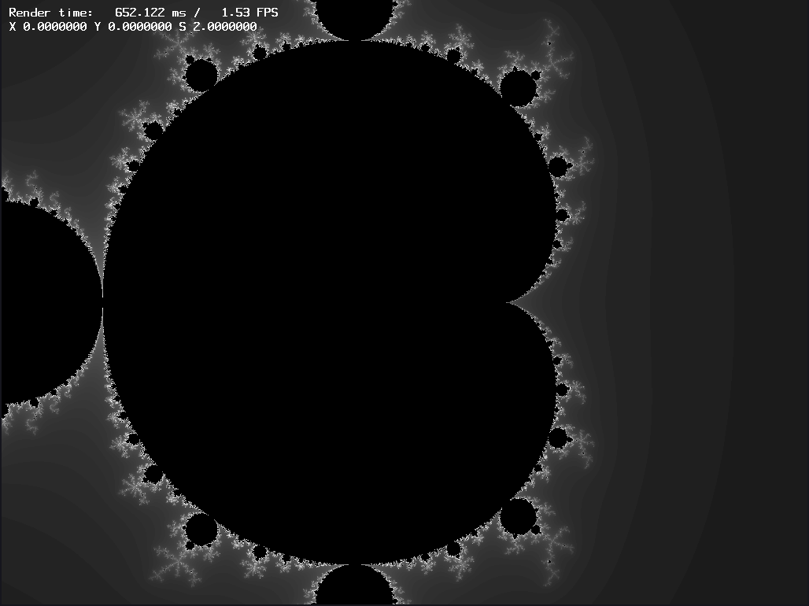
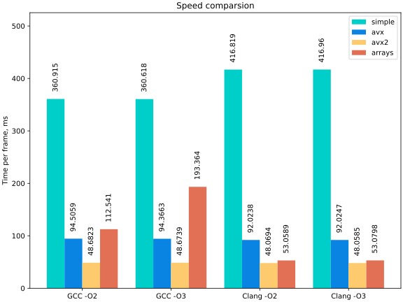

# Быстрое вычисление множества Мандельброта

Данная лабораторная посвящена реализации вычислителя 
множества Мандельброта на C. Что и было сделано.

## Реализация

### Метод построения

Здесь использвовался простой алгоритм построения, без сглаживания.
Берём начальную точку в $`z_0 \in \mathbb{C}`$, и считаем рекуррентную
последовательность $`z_{n+1} = z_n^2 + z_0`$. Если $`|z_n| > 10`$, то 
завершаем рассчёт. Полученное таким образом $`n`$ определяет цвет.

Визуализатор преобразовывает это $`n`$ в цвет несколькими способами,
в зависимости от выбранной палитры. При замере времени считаются только $`n`$.

Реализации четыре:

 - `simple` -- простая реализация без каких-либо ручных оптимизаций,
    относительно которой будет считаться прирост скорости.

 - `avx` -- версия, использующая `avx`-интринсики

 - `avx2` -- использует `avx2`

 - `arrays` -- считаем массивами по 8 пикселей в ряд, компилятор должен оптимизировать это.

Все они в `src/gen/`.

### Визуализатор

Программа, отображающая множество с помощью фреймбуффера на `SDL2`.
Компилируется так (можно либо через gcc, либо через clang):

```bash
$ ./build.py build/viewer-[clang/gcc]
$ ./build/viewer-[clang/gcc]
```

Клавиши:

 - стрелки для движения
 - `PgUp`/`PgDn` для приближения/отдаления
 - `g` для смены реализцаии
 - `c` для смены палитры

### Бенчмаркер

Это программа, замеряющая производительность реализаций рассчёта $`n`$ для
каждого пикселя на изображении. Компилируется так:


```bash
$ ./build.py build/bench-[clang/gcc]
$ ./build/bench-[clang/gcc] ОПЦИИ
```

Считает кадр размера $1024 \times 768$ пикселей (такой же размер окна у просмотрщика),
с центром в $(0, 0)$ и шириной окна $2$ (то есть левый край окна это $x = -1$,
правый $x = 1$).

Замер работает так: считаем кадр, кидаем время рассчёта в кольцевой буффер длинны N.
Когда весь буффер заполнен, и время в нём имеет небольшой относительный разброс,
то мы признаём алгоритм достаточно стабильным и выводим результаты.

Соответственно, опции таковы:

 - `-g GEN` -- какую реализацию будем замерять: `simple`, `avx` или `avx2`
 - `-m MSR` -- размер буффера, то есть сколько запусков мы будем усреднять
 - `-v VAR` -- алгоритм считается стабильным, если за последние $`MSR`$ разов
    $`t_{min} * VAR >= t_{max}`$.

 - `-h` -- help

 Замеры проводятся скриптом `benchmark.sh`, о нём попозже.

## Измерения

### Обстановка

 - Стационарный компьютер с `Intel(R) Core(TM) i3-8100 CPU @ 3.60GHz`
 - `Arch Linux`, ядро `6.13.7-arch1-1`
 - Выключенное графическое окружение
 - `clang version 19.1.7`, `gcc (GCC) 14.2.1 20250207`
 - Флаги можно увидеть в `build.py`
 - Для того, чтобы время считалось стабильным, за последние 128 запусков максимум должен быть не больше минимума на 0.1%.
 - Проводилось по 4 запуска программы-измерителя

Замеры выполняются через `./build.py res/bench.target`. Результаты пишутся в `res/`.

### Результаты

Все логи можно видеть в `res/`

Усреднённые результаты (`Omega` это среднеквадратичное отклонение результатов), цифры в миллисекундах.

| Build      | Method     | Avg. time  | Omega      |
|------------|------------|------------|------------|
| gcc-o2     | simple     |  360.91547 |    0.01383 |
| gcc-o2     | avx        |   94.50588 |    0.00925 |
| gcc-o2     | avx2       |   48.68228 |    0.00213 |
| clang-o2   | simple     |  416.81937 |    0.00455 |
| clang-o2   | avx        |   92.02382 |    0.00129 |
| clang-o2   | avx2       |   48.06942 |    0.00114 |
| gcc-o3     | simple     |  360.61848 |    0.01067 |
| gcc-o3     | avx        |   94.36627 |    0.00976 |
| gcc-o3     | avx2       |   48.67392 |    0.00230 |
| clang-o3   | simple     |  416.96033 |    0.00577 |
| clang-o3   | avx        |   92.02466 |    0.00286 |
| clang-o3   | avx2       |   48.05847 |    0.00134 |
| gcc-o2     | arrays     |  112.54066 |    0.00378 |
| clang-o2   | arrays     |   53.05892 |    0.00089 |
| gcc-o3     | arrays     |  193.36361 |    0.00259 |
| clang-o3   | arrays     |   53.07978 |    0.00157 |

Или в виде графика:



(график делается через `./build.py plot.svg`)

Видим, что:

 - Базовая версия под clang компилируется хуже.
 - При использовании avx скорость у GCC возрастает в ~ 3.8 раза, у clang в ~ 4.5 раза
 - При `avx2` скорость возрастает в ~ 1.9 по сравнению с `avx`, это не зависит от компилятора.
 - gcc плохо справляется с версией с массивами, на `-O3` с ней совсем плохо. Но все равно быстрее, чем без массивов.
 - clang понимает, что мы хотим и его результат почти совпадает с написанной вручную версией.

## Зависимости

Использует `SDL2` и `avx/avx2` интринсики, так что нужен процессор `x86-64`.

## Ссылки

 - Используемый безымянный шрифт -- https://courses.cs.washington.edu/courses/cse457/98a/tech/OpenGL/font.c

