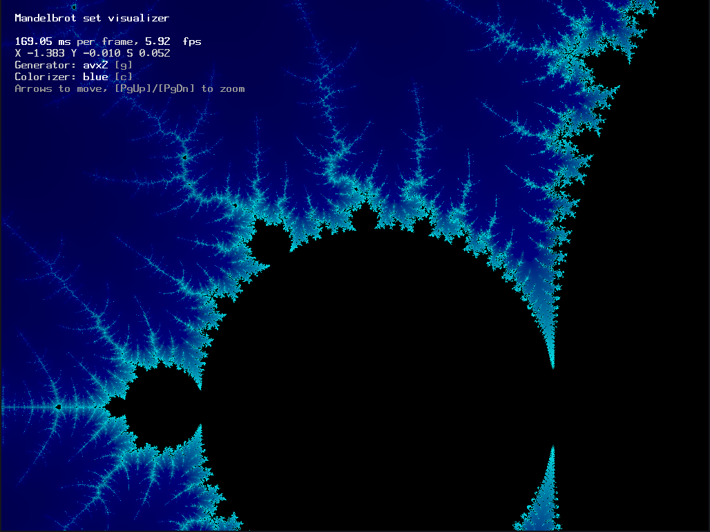

# Быстрое вычисление множества Мандельброта

Здесь реализовано два варианта -- простой и с использованием `avx2`.
Множество считается на `float`-ах.

 - Простой: [`gen/simple.c`](gen/simple.c)
 - AVX2: [`gen/avx2.c`](gen/avx2.c)

## Компиляция

```bash
$ cd viewer
$ make
$ ./viewer
```

Опции:

 - `-b NUM_RUNS`: Запускаем замер времени, делаем `NUM_RUNS` измерений.
 - `-s NUM_START`: Проводим вычисление `NUM_START` раз до начала замера,
   чтобы прогреть процессор, составить вероятности веток, загрузить кэши и прочее.
 - `-o N`: Выбираем оптимизации: `0` это базовая версия, `1` это AVX, `2` это AVX2.

Без `-b` открывается окно с просмотрщиком.

## Результаты

Замеры производились при выключенном энергосбережении,
без запущенного графического окружения.

### Базовая версия

```bash
$ ./viewer -b 32 -s 4
```

```
Done 4 warmup runs and 32 measurment runs
Time avg 361.424561 ms, std dev 0.197642 ms
With 𝜎 (68% probability) time is 361.424561 ± 0.197642 ms
With 3𝜎 (99.73% probability) time is 361.424561 ± 0.592927 ms
Have 0 outliers
Non-outlier runs are withn 0.301𝜎, outliers (>3𝜎) are withn 0.000𝜎
```

Итого, `361.42 ± 0.59 ms`.

### С интринсиками AVX2

```bash
$ ./viewer -o 2 -b 128 -s 16
```

```
Done 16 warmup runs and 128 measurment runs
Time avg 48.793472 ms, std dev 0.044194 ms
With 𝜎 (68% probability) time is 48.793472 ± 0.044194 ms
With 3𝜎 (99.73% probability) time is 48.793472 ± 0.132583 ms
Have 0 outliers
Non-outlier runs are withn 0.600𝜎, outliers (>3𝜎) are withn 0.000𝜎
```

Итого, `48.79 ± 0.13 ms` милисекунд.

## Результат

Всё ускорилось в ~ `7.41 ± 0.35` раза.
